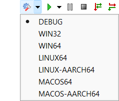

Simba
=====

Simba is a program used to repeat certain (complicated) tasks. Typically these tasks involve using the mouse and keyboard. Simba is programmable, which means you can design your own logic and steps that Simba will follow, based upon certain input such as colors on the screen.

The scripting language used is [Lape](https://github.com/nielsAD/lape) which uses a Pascal-like syntax.

Simba is available for:
 - Windows (32 & 64 bit)
 - Linux (64 bit & AArch64)
 - MacOS (64 bit & AArch64)

Some dependencies are required for both building and running on Linux/MacOS.

Linux:
  - `Xtst` `sudo apt-get install libxtst-dev`
  - `gtk2` `sudo apt-get install gtk2.0 libgtk2.0-dev`
  - `libffi` `sudo apt-get install libffi-dev`
  - `openssl` `sudo apt-get install openssl`
  
MacOS:
  - `libffi` `brew install libffi`

------
## Building Simba

Simba is a [Lazarus](https://www.lazarus-ide.org/) project. Lazarus is available here: https://sourceforge.net/projects/lazarus/files/ the latest version should work.

Steps:
1) Clone the Simba repository & install submodules `git clone --recurse-submodules https://github.com/Villavu/Simba`. 
2) Open `Source/Simba.lpi` in Lazarus.
3) Select the build mode required.

4) Build Simba (Run > Build) and when completed the Simba executable will be located in the root directory of the repository.